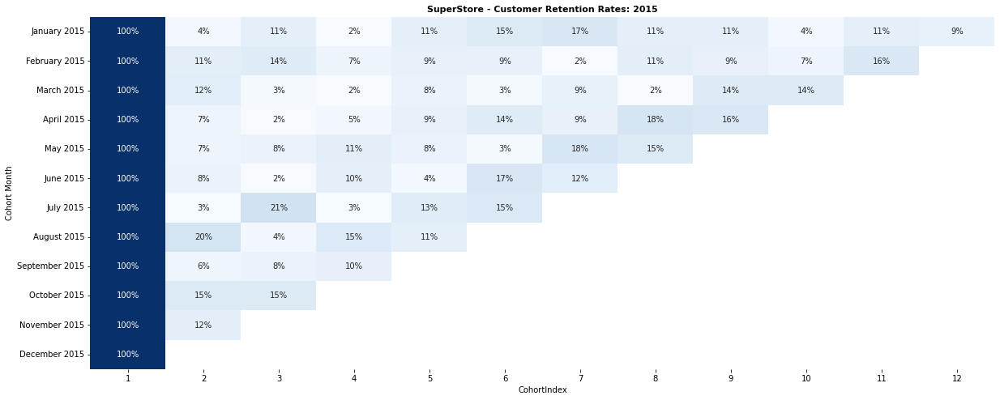

## 👨‍💻Wayne Willis Omondi
📞 ***+254768715840***, ***+254755976610***<br>
📧***wayneaudu6@outlook.com***<br>
📄<ins><a id="raw-url" href="https://raw.githubusercontent.com/WayneNyariroh/portfolio/main/Wayne_Willis_RESUME.pdf">My Resume</a></ins>

---

My journey into Data Science and Data Engineering.
> feel free to explore the source codes 👍

### <ins>[1: Exploratory Data Analysis & Visualization Using Python](https://github.com/WayneNyariroh/StoreSales_Analysis)</ins>
Every business is highly dependent on its data to make better decisions for growth and success, data analysis plays an important role in helping different business entities to get an idea on their performance and any opportunities to increase gains and minimise losses. 
The objective was to gain valuable insights on the overall performance of the Store.
> Data was sourced from ***Kaggle***. <br>
> **Tools used**: Python, pandas, numpy, jupyter lab, matplotlib and seaborn. <br>
> **Activities**: Data processing, data cleaning, data querying and vizualization. <br>
> **Concepts explored**: Correlation, Pivoting and Indexing, Date Manipulation. <br>

Insights:<br>
```python
{
plt.figure(figsize=(20,5))
plt.title('SuperStore - Number of Sales Each Month for the Review Period: 2015 - 2019', fontsize=11, fontweight='bold')
sns.heatmap(no_of_sales_table2, cmap='Blues', annot=True, annot_kws={"size":11}, fmt="d", cbar=False) 
}
```

<br>

<ins> [View Project](https://github.com/WayneNyariroh/StoreSales_Analysis/blob/main/superStoreSales_EDA.ipynb)</ins>

---
### <ins>[2: Customer Retention: Performing a Cohort Analysis using Python](https://github.com/WayneNyariroh/customer-retention_cohortAnalysis/blob/main/RetentionAnalysis.ipynb)</ins>
Monitoring retention metrics is critical for a business to understand lifetime customer value and to quantify the efficacy of its marketing strategy and customer service program.
***Customer retention is when one of your buyers purchases from you again***.<br>

```python
{
retention_rates_2015 = cohort_table_2015.divide(cohort_table_2015.iloc[:,0], axis=0)

plt.figure(figsize=(20,8))
plt.title('SuperStore - Customer Retention Rates: 2015',fontsize=11, fontweight='bold')
sns.heatmap(retention_rates_2015, annot=True, cmap='Blues', fmt='.0%')
plt.show()
}
```

<br>

> *In the figure, Cohort Index 1 serves as the first month a customer made an order, hence the values is 100% for each cohort month. The values in the subsequent Cohort Index shows how many of the customers in that monthly cohort made a new order. i.e, in Cohort Index 2 a month after the first order, 4% of the customers who made an order in January 2015 made a new purchase with the store*<br>

A business' customer retention rate compares the number of customers you have retained to your total number of customers during a certain period. You can use customer loyalty programs, customer feedback surveys, social media and additional incentives to improve your customer retention rate.<br>
>SuperStore dataset from ***Kaggle*** & it serves as a continuation of the [Exploratory Data Analysis Project](https://github.com/WayneNyariroh/StoreSales_Analysis) above<br>
> **Tools used**: Python, pandas, jupyter lab, matplotlib and seaborn. <br>
> **Activities**: Data processing, data cleaning, data querying, creating pivot tables, indexing, and vizualization. <br>
> **Concept explored:** Cohorts.<br>


Clients are assigned to a cohort based on the first time they appeared in the dataset i.e, the time of first order, then their behaviour monitored over a duration. Concept of Cohorts and Retention Analysis can be extended to various organizations and institutions; a private clinic can use it to observe returning patients or monitor appointment keeping.<br>

<ins>[View Project](https://github.com/WayneNyariroh/customer-retention_cohortAnalysis/blob/main/RetentionAnalysis.ipynb)</ins>

---
### <ins>[3: PowerBI Visualization Project](https://github.com/WayneNyariroh/StoreSales_PowerBI_Dashboard)</ins>


A simple and user-friendly dashboard that display annotations of each value and allows filtering on the visualizations and insights based on selected values, focusing on Revenue, Number of Sales and Profit to allow interactivity.<br>
 
<ins>[View Project](http://github.com/WayneNyariroh/StoreSales_PowerBI_Dashboard)</ins>


